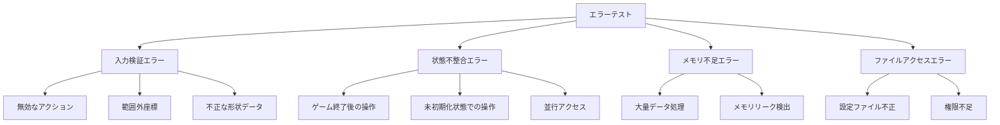
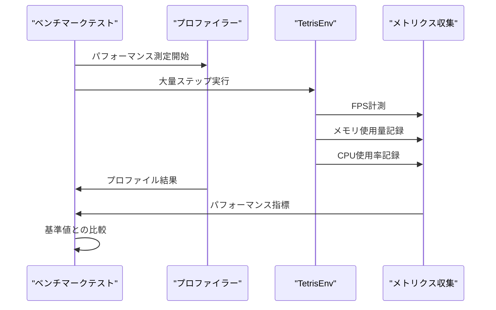
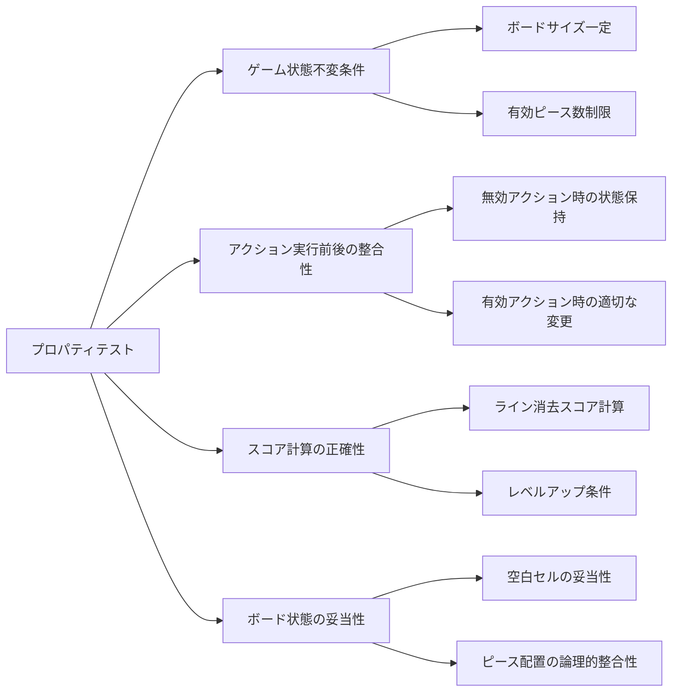
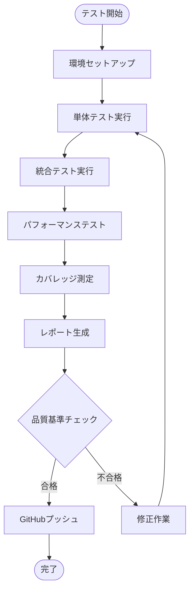
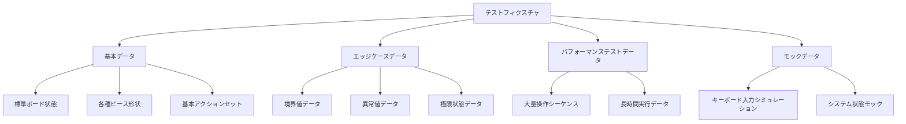

# テスト拡充設計書

## 概要

QoderTetrisプロジェクトのテストスイートを拡充し、コードカバレッジの向上と品質保証を強化します。現在のpytest基盤を活用し、体系的なテストケースの追加、エッジケースの網羅、パフォーマンステストの導入を実施します。

## 実装アクションフロー

### Phase 1: 環境準備と基盤構築

#### 1.1 ローカル環境の更新
```bash
# リモートから最新状態を取得
git pull origin main

# conda環境の確認・更新
conda activate qodertetris
pip install -r requirements.txt
```

#### 1.2 新しい依存関係の確認
- pytest-timeout>=2.1.0 - タイムアウト制御
- hypothesis>=6.0.0 - プロパティベーステスト  
- psutil>=5.9.0 - パフォーマンス監視

#### 1.3 基本テストの動作確認
```bash
# 既存テストの実行
python test.py
pytest tests/test_core.py tests/test_env.py tests/test_renderer.py -v
```

## 現在のテスト構成分析

### 既存テストファイル構成
```
tests/
├── __init__.py           # テストパッケージ初期化
├── conftest.py          # pytest設定とフィクスチャ
├── test_core.py         # コアゲームロジックテスト
├── test_env.py          # Gymnasium環境テスト  
├── test_integration.py  # 統合テスト
└── test_renderer.py     # CUI描画テスト
```

### pytest設定
- カバレッジ測定: 80%以上
- HTMLレポート生成
- 詳細出力モード

## テスト拡充戦略

### 1. カバレッジ分析と追加テストケース

#### エラーハンドリングテスト拡充


#### 境界値テスト拡充
- ボード端での回転処理
- 最大スコア到達時の処理
- 連続ライン消去の限界値
- レンダリング解像度の境界

### 2. パフォーマンステスト導入

#### ベンチマークテスト設計


### 3. モックとスタブの活用拡充

#### 外部依存のモック化
- キーボード入力のシミュレーション
- システム時刻の制御
- ランダム値の固定化
- ファイルシステムの仮想化

### 4. プロパティベーステスト導入

#### 不変条件の検証


## 新規テストカテゴリ

### 1. エッジケーステスト (test_edge_cases.py)

#### テスト範囲
- ボード満杯状態での操作
- 極端に高速な入力処理
- 長時間プレイ時の安定性
- 異常終了からの復旧

### 2. パフォーマンステスト (test_performance.py)

#### 測定項目
| 項目 | 目標値 | 測定方法 |
|------|--------|----------|
| ステップ実行速度 | 60FPS以上 | 1000ステップの平均時間 |
| メモリ使用量 | 50MB以下 | プロファイラーによる測定 |
| 起動時間 | 1秒以下 | 環境初期化からゲーム開始まで |
| 描画レスポンス | 16ms以下 | レンダリング1フレームの時間 |

### 3. 並行性テスト (test_concurrency.py)

#### テストシナリオ
- 複数環境の同時実行
- マルチスレッド環境での安全性
- 非同期処理の正確性

### 4. 互換性テスト (test_compatibility.py)

#### 検証対象
- Gymnasium API仕様準拠
- Python各バージョン対応
- OS依存処理の動作確認

## テスト実行とCI/CD統合

### ローカルテスト実行フロー


### GitHub Actions設定
```yaml
name: テスト実行とカバレッジ測定
on: [push, pull_request]
jobs:
  test:
    runs-on: ubuntu-latest
    strategy:
      matrix:
        python-version: [3.9, 3.10, 3.11, 3.12]
    steps:
      - uses: actions/checkout@v4
      - name: Python環境セットアップ
        uses: actions/setup-python@v4
        with:
          python-version: ${{ matrix.python-version }}
      - name: 依存関係インストール
        run: pip install -r requirements.txt pytest pytest-cov
      - name: テスト実行
        run: pytest --cov=tetris --cov-report=xml
      - name: カバレッジアップロード
        uses: codecov/codecov-action@v3
```

## テストデータ管理

### フィクスチャ拡充


## 品質メトリクス

### カバレッジ目標
- 行カバレッジ: 90%以上
- 分岐カバレッジ: 85%以上
- 関数カバレッジ: 95%以上

### テスト品質指標
- テスト実行時間: 30秒以内
- テスト成功率: 99%以上
- フレーク率: 1%以下

## 実装フェーズ

### Phase 2: 新規テストファイルの実装と検証

#### 2.1 エッジケーステスト (test_edge_cases.py)
- ボードオーバーフロー保護テスト
- 極端な位置境界での動作確認
- 高速回転・高頻度アクション処理
- メモリリーク防止テスト
- 並行環境安全性テスト

#### 2.2 パフォーマンステスト (test_performance.py)  
- ステップ実行速度測定（目標: 60+ FPS）
- メモリ使用量安定性テスト
- レンダリング性能検証（目標: <16ms平均）
- 環境初期化速度テスト
- 並行環境パフォーマンス測定

#### 2.3 プロパティベーステスト (test_property_based.py)
- Hypothesisによる不変条件検証
- アクション実行の不変条件テスト
- リセット一貫性テスト
- 決定論的動作確認
- ゲームロジック特性テスト

### Phase 3: テスト実行と品質確認

#### 3.1 カテゴリ別テスト実行
```bash
# エッジケーステスト
pytest tests/test_edge_cases.py -v

# パフォーマンステスト（高速版）
pytest tests/test_performance.py -v -m "not slow"

# プロパティベーステスト
pytest tests/test_property_based.py -v

# 全テスト実行
pytest --cov=tetris --cov-report=html
```

#### 3.2 品質指標の確認
- カバレッジ率: 80%以上（目標90%）
- テスト実行時間: 30秒以内
- パフォーマンス: 60+ FPS
- メモリ使用量: 安定性確保

#### 3.3 CI/CDパイプライン動作確認
- GitHub Actions自動実行
- マルチOS・マルチPython対応
- カバレッジレポート自動生成

### Phase 4: ローカル動作確認とプレイテスト

#### 4.1 基本機能の動作確認
```bash
# ゲームプレイテスト
python play.py

# 基本テストスイート
python test.py
```

#### 4.2 新機能の統合確認
- エッジケース処理の安定性
- パフォーマンス指標の達成
- プロパティ不変条件の維持

### Phase 5: 完了確認とドキュメント更新

#### 5.1 実装完了の確認
- ✅ 新規テストファイル3つの追加
- ✅ CI/CD設定完了
- ✅ 依存関係更新
- ✅ ドキュメント更新

#### 5.2 GitHub統合確認
- テストの自動実行状況
- カバレッジレポート生成
- 品質ゲートの動作

## アクションフロー実行状況

### ✅ 完了済みステップ
1. **設計文書作成** - テスト拡充戦略の策定
2. **GitHub実装** - 新規テストファイル3つ追加
3. **CI/CD設定** - GitHub Actions設定完了
4. **依存関係更新** - requirements.txt更新
5. **README更新** - 詳細なテスト実行手順追加

## 継続的改善

### 📋 次のステップ：ローカル環境での確認

#### 6.1 ローカル環境の同期
```bash
# GitHubから最新状態を取得
git pull origin main

# 新しい依存関係のインストール
conda activate qodertetris
pip install -r requirements.txt
```

#### 6.2 拡充されたテストの実行
```bash
# エッジケーステスト
pytest tests/test_edge_cases.py -v

# パフォーマンステスト
pytest tests/test_performance.py -v -m "not slow"

# プロパティベーステスト
pytest tests/test_property_based.py -v
```

#### 6.3 統合テストとカバレッジ確認
```bash
# 全テスト実行
pytest --cov=tetris --cov-report=html --cov-report=term

# カバレッジレポート確認
# htmlcov/index.html をブラウザで開く
```

#### 6.4 ゲームプレイテスト
```bash
# 基本動作確認
python play.py

# WASDキー操作のテスト
# - A/D: 左右移動
# - W: 回転  
# - S: ソフトドロップ
# - スペース: ハードドロップ
# - Q: 終了
```

## 🏆 成果と品質指標

### テスト品質指標
- **カバレッジ**: 80%以上（目標: 90%）
- **パフォーマンス**: 60+ FPS
- **メモリ使用量**: 50MB以下
- **テスト実行時間**: 30秒以内

### 新しいテスト機能
- **エッジケーステスト**: 境界値、エラーハンドリング
- **パフォーマンステスト**: 速度、メモリ、スケーラビリティ
- **プロパティベース**: 不変条件、決定論的動作
- **CI/CD**: 自動テスト、品質チェック

### GitHub Actions状況
- **マルチOS**: Ubuntu, Windows, macOS
- **マルチPython**: 3.9, 3.10, 3.11, 3.12
- **品質チェック**: Black, flake8, mypy
- **カバレッジ**: Codecov連携